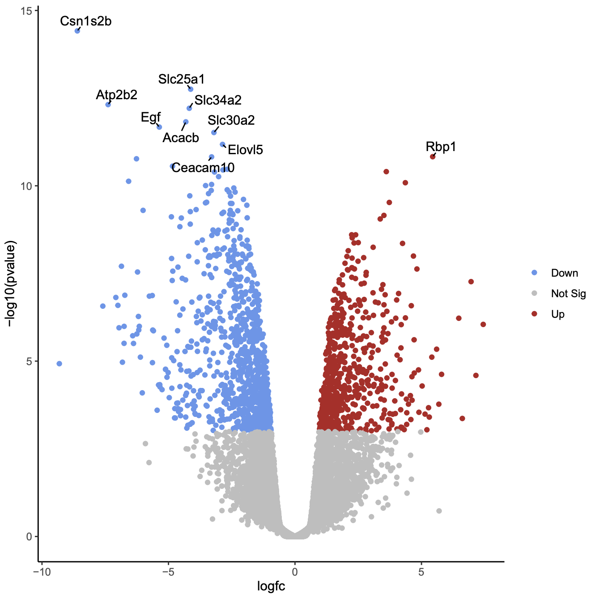

# worm-aging

## Title: Differential Expression Analysis on Aging in C.Elegans 

Roux et al. published a fascinating paper in 2023 titled "Individual cell types in C. elegans age differently and activate distinct cell-protective responses", in which they perform single-cell RNA sequencing on C. Elegans cultures for 15 different timepoints (Day 1-Day 15) in order to explore the effect of aging on gene expression in both a global and tissue-specific manner. We intend to use the dataset provided by these authors on the Gene Expression Omnibus in order to compare genes that are significantly upregulated and downregulated in C.Elegans neurons, muscle, and epithelium between day 1 to day 15. 

Datasets (Day1 - Day15 samples): https://www.ncbi.nlm.nih.gov/geo/query/acc.cgi?acc=GSE208154

Software: Seurat v5 (https://satijalab.org/seurat/) and/or Monocle (http://cole-trapnell-lab.github.io/monocle-release/) for clustering and DE analysis. Ggplot2 for plotting. 

## Plan
1. Use Seurat or Monocle R packages to do initial loading in of the dataset (just the Day1 and Day15 samples) from the GEO page. Next, we will do a basic DE analysis on the combined neuron, epithelium and muscle cells over D1 and D15 to make sure that we can see the age-based expression change reported in the paper. We will visualize this analysis with a volcano plot, as seen below: 
.tif)

