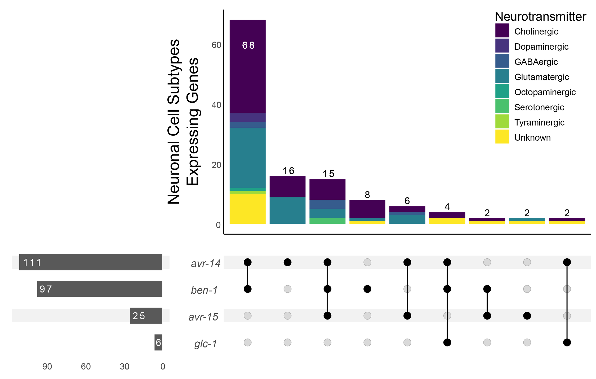

# worm-aging

## Title: Differential Expression Analysis on Aging in *C. elegans* 

Roux et al. published a fascinating paper in 2023 titled "Individual cell types in *C. elegans* age differently and activate distinct cell-protective responses", in which they perform single-cell RNA sequencing on *C. elegans* cultures for six different timepoints (Days 1, 3, 5, 8, 11, and 15) in order to explore the effect of aging on gene expression in both a global and tissue-specific manner. We intend to use the dataset provided by these authors on the Gene Expression Omnibus in order to compare genes that are significantly upregulated and downregulated in *C. elegans* neurons, muscle, and epithelium from day 1 to day 15. 

Datasets (Day1 - Day15 samples): https://www.ncbi.nlm.nih.gov/geo/query/acc.cgi?acc=GSE208154

Software: Seurat v5 (https://satijalab.org/seurat/) and/or Monocle (http://cole-trapnell-lab.github.io/monocle-release/) for clustering and DE analysis. Ggplot2 for plotting. 

## Plan
1. Use Seurat or Monocle R packages to do initial loading in of the dataset (just the Day1 and Day15 samples) from the GEO page. Next, we will do a basic DE analysis on the combined neuron, epithelium and muscle cells over D1 and D15 to make sure that we can see the age-based expression change reported in the paper. We will visualize this analysis with a volcano plot, such as the one seen below: 

Once we have the volcano plot, we will do a more focused DE analysis on each tissue type described above. Once we have a set of 15+ genes that are significantly upregulated/downregulated between day 1 and day 15, we will compare the upregulated/downregulated genes that are unique to and shared between each tissue with an upset plot, as shown below:

2. For a "reach" goal (more than 5 hours), we could introduce some other in-between timepoints (day 5, day 10) and potentially find new ways to visualize expression changes over a larger set of timepoints. 

3. Another reach goal: perform a GO search for the genes that are differentially expressed between our tissue types, find a way to visualze the 4 or 5 most signfiicant terms that are differentially enriched between our tissue types, and see if those terms are reasonable given the conclusions reached in the paper. 